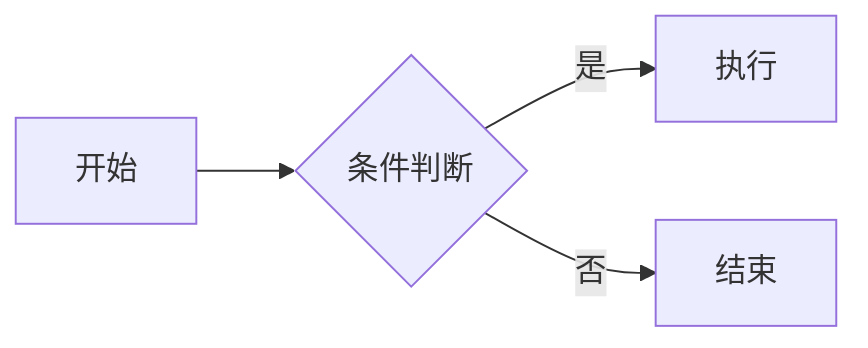

# 文档中心

> 版本：1.0.0 | 更新日期：2026-07-14 | 文档语言：简体中文

CSAM Repair 的全部文档按主题分类存放在以下子目录中。

## 目录结构

```
docs/
├── README.md            # 本文件（文档中心 + 写作规范）
├── 用户手册/            # 面向最终用户
├── 开发文档/            # 面向开发者
├── 架构设计/            # 面向架构师
├── MATLAB集成/          # MATLAB 算法相关
├── API/                 # 通信协议与接口
├── 调试指南/            # 测试与故障排查
├── 发布说明/            # 版本发布说明
├── FAQ/                 # 常见问题
├── 更新日志/            # 版本变更记录
├── images/              # 共享图片资源
├── scripts/             # 文档自动检查脚本
└── archive/             # 历史文档归档
```

## 快速查找

| 我想了解 | 去哪里看 |
|----------|----------|
| 软件怎么装 | [用户手册/安装部署](用户手册/安装部署.md) |
| 软件怎么用 | [用户手册/使用手册](用户手册/使用手册.md) |
| 5 分钟上手 | [用户手册/快速开始](用户手册/快速开始.md) |
| MATLAB 算法 | [MATLAB集成/算法说明](MATLAB集成/算法说明.md) |
| Windows + MATLAB R2025b 验收 | [MATLAB集成/Windows 与 MATLAB R2025b 稳定性验收手册](MATLAB集成/Windows与MATLAB_R2025b稳定性验收手册.md) |
| 通信协议 | [API/通信协议](API/通信协议.md) |
| 接口字段 | [API/API接口](API/API接口.md) |
| 软件架构 | [架构设计/软件架构](架构设计/软件架构.md) |
| 怎么开发 | [开发文档/开发指南](开发文档/开发指南.md) |
| 怎么测试 | [调试指南/测试验证](调试指南/测试验证.md) |
| 遇到问题 | [调试指南/故障排查](调试指南/故障排查.md) |
| 常见问题 | [FAQ/常见问题](FAQ/常见问题.md) |
| 版本变更 | [更新日志/更新日志](更新日志/更新日志.md) |

完整索引请参阅根目录的 [DOCUMENT_INDEX.md](../DOCUMENT_INDEX.md)。

---

## 文档写作规范

### 文件命名

- 使用中文文件名，语义清晰
- 不加数字前缀（分类由目录决定）
- 扩展名统一 `.md`

### 文档头部格式

每篇文档以以下格式开头：

```markdown
# 文档标题

> 版本：1.0.0 | 协议：v2.1 | 更新日期：2026-07-14 | 文档语言：简体中文

---
```

字段说明：
- **版本**：软件版本号
- **协议**：通信协议版本
- **更新日期**：最后修改日期
- **文档语言**：固定为"简体中文"

### 目录

篇幅超过 200 行的文档，在头部之后添加"## 目录"章节，列出主要章节链接。

### 交叉引用

使用相对路径引用其他文档：

```markdown
详见 [算法说明](../MATLAB集成/算法说明.md)。
```

从根目录 README.md 引用时：

```markdown
详见 [算法说明](docs/MATLAB集成/算法说明.md)。
```

### 图片

所有图片存放在 `docs/images/` 目录。引用时使用相对路径：

```markdown

```

### 流程图

使用 Mermaid 语法编写流程图，可直接在 Markdown 中渲染：

````

````

### 表格

使用标准 Markdown 表格语法，表头左对齐。

### 代码块

标注语言类型：

````markdown
```python
print("hello")
```
````

### 语言

- 全部使用简体中文
- 术语首次出现时附英文原文，如"冷喷涂增材制造（Cold Spray Additive Manufacturing，CSAM）"
- 面向非技术用户的文档避免使用编程术语
- 代码注释使用中文

---

## 自动检查

文档完整性自动检查脚本位于 [scripts/check_docs.py](scripts/check_docs.py)。

运行方式：

```powershell
python docs/scripts/check_docs.py
```

检查项目：
- 文档头部格式是否规范
- 交叉引用链接是否有效
- 图片引用是否存在
- 是否存在空目录
- 是否有未归类的散落文档
