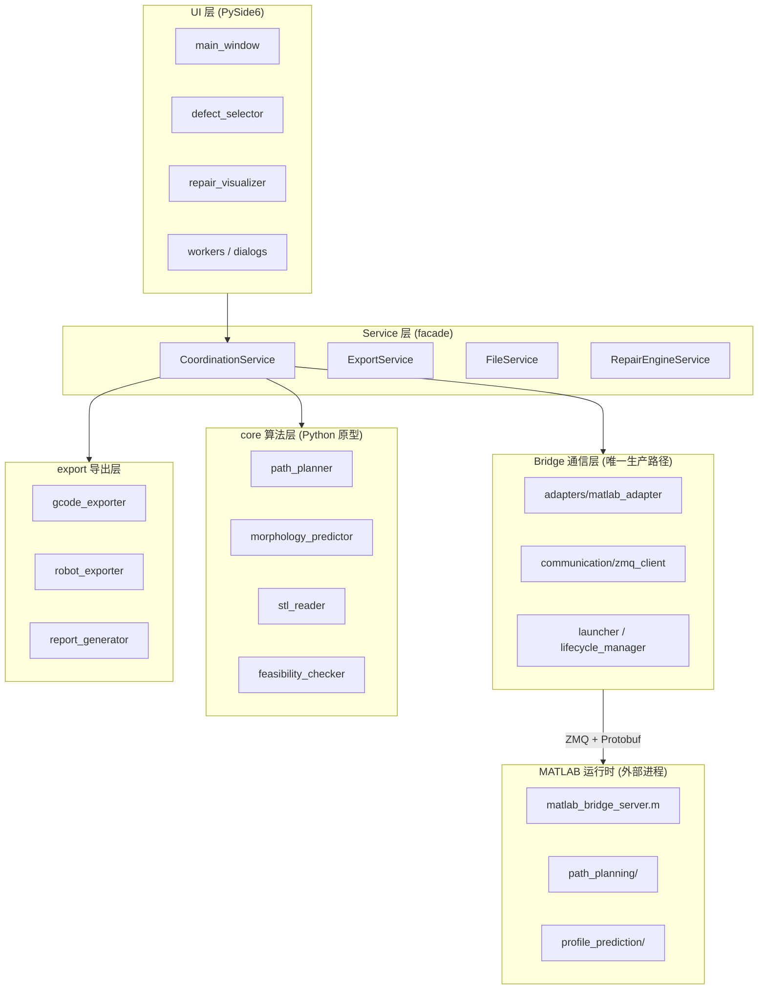
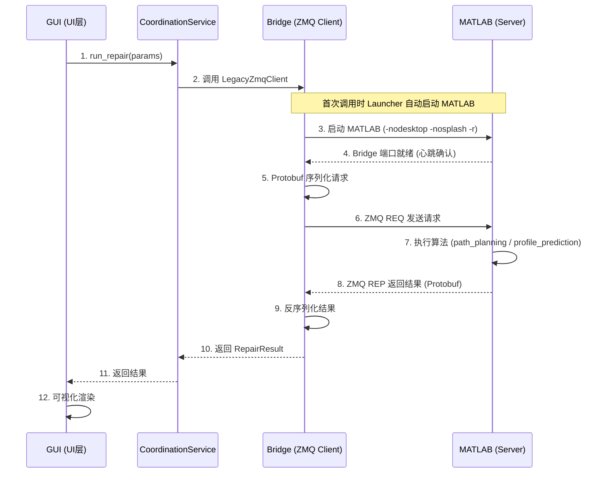
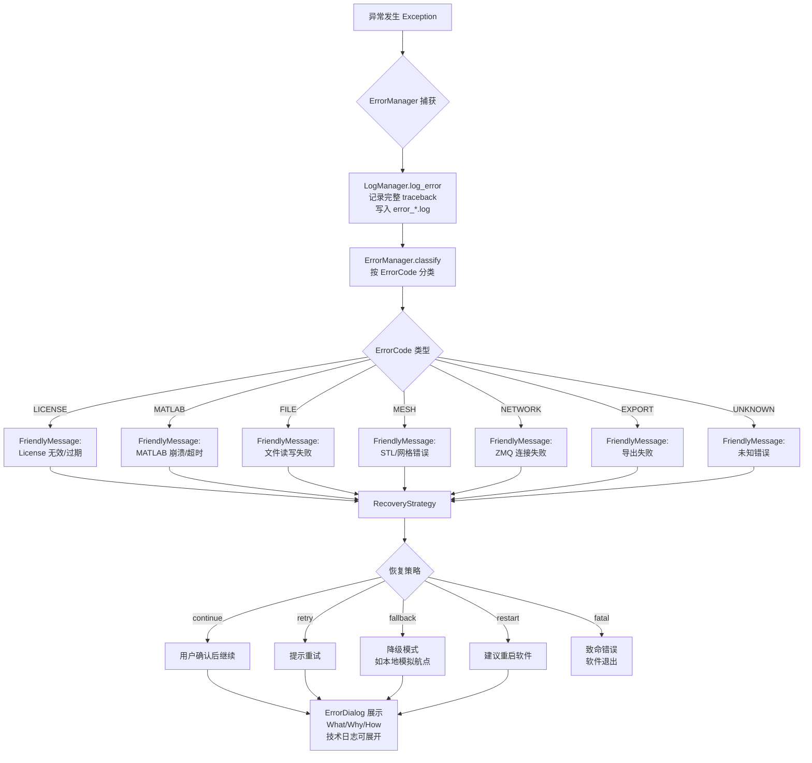
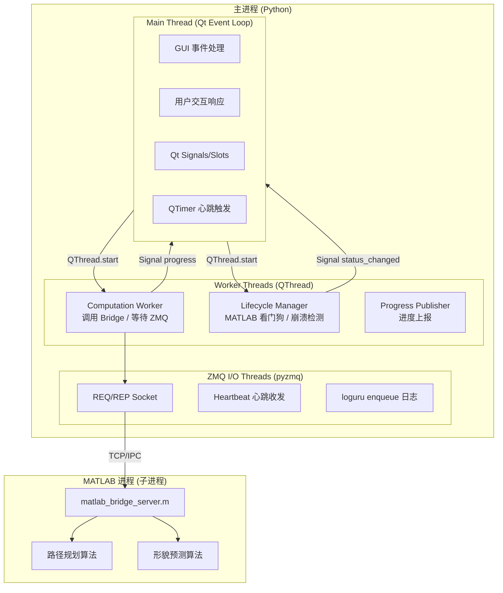
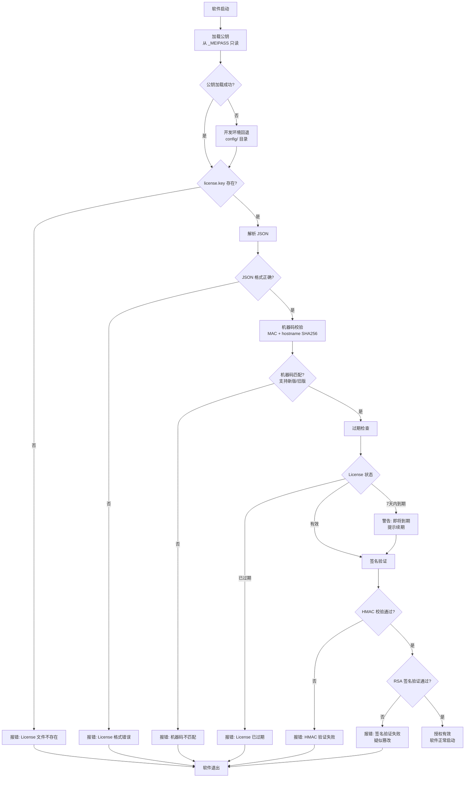
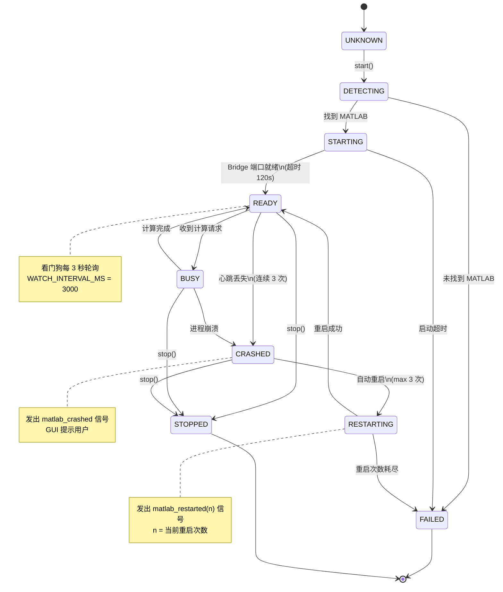

# CSAM Repair v1.0 架构图

版本：1.0.0 | 发布日期：2026-07-15。

本文档用 ASCII art 和 Mermaid 绘制系统核心架构图。

---

## 1. 系统架构分层图

### 1.1 ASCII 版

```
┌─────────────────────────────────────────────────────────────────┐
│                        UI 层 (PySide6)                          │
│  main_window / defect_selector / repair_visualizer / dialogs    │
│  workers / theme_manager / toast / pipeline_indicator           │
└───────────────────────────┬─────────────────────────────────────┘
                            │  仅通过 CoordinationService 调用
                            │  禁止直连 core / communication
                            ▼
┌─────────────────────────────────────────────────────────────────┐
│                  Service 层 (facade / 中介)                     │
│  CoordinationService / ExportService / FileService              │
│  RepairEngineService / ValidationService                        │
└───────────────────────────┬─────────────────────────────────────┘
                            │
            ┌───────────────┼───────────────┬─────────────┐
            ▼               ▼               ▼             ▼
┌───────────────────┐ ┌─────────────┐ ┌───────────┐ ┌──────────┐
│   Bridge 通信层   │ │  core 算法  │ │  export   │ │ domain   │
│  (唯一生产路径)   │ │  (Python    │ │  导出层   │ │ 领域模型 │
│                   │ │   原型)     │ │           │ │          │
│ adapters/         │ │             │ │ gcode_    │ │ models   │
│  matlab_adapter   │ │ path_       │ │  exporter │ │ inter-   │
│  legacy_adapter   │ │  planner    │ │ robot_    │ │  faces   │
│ communication/    │ │ morphology_ │ │  exporter │ │          │
│  zmq_client       │ │  predictor  │ │ report_   │ └──────────┘
│  zmq_server       │ │ stl_reader  │ │  generator│
│  heartbeat        │ │ feasibility │ │           │
│ services/         │ │  _checker   │ │ validator │
│  matlab_service   │ │ material_db │ └───────────┘
│ launcher          │ └─────────────┘
│ lifecycle_manager │
│ progress_publisher│
└────────┬──────────┘
         │  ZMQ + Protobuf
         ▼
┌─────────────────────────────────────────────────────────────────┐
│                    MATLAB 运行时 (外部进程)                      │
│  matlab_bridge_server.m  ←  ZMQ Server                          │
│  path_planning/         ←  路径规划算法                          │
│  profile_prediction/    ←  形貌预测算法                          │
│  启动模式: -nodesktop -nosplash -r                              │
└─────────────────────────────────────────────────────────────────┘
```

### 1.2 Mermaid 版



---

## 2. 通信流程图

### 2.1 ASCII 版

```
┌──────────┐                        ┌──────────────┐                    ┌─────────┐
│  GUI     │                        │  Bridge      │                    │ MATLAB  │
│ (UI层)   │                        │  (ZMQ Client)│                    │ (Server)│
└────┬─────┘                        └──────┬───────┘                    └────┬────┘
     │                                     │                                 │
     │ 1. 用户点击"开始计算"               │                                 │
     │   CoordinationService.run_repair()  │                                 │
     ├────────────────────────────────────►│                                 │
     │                                     │                                 │
     │                                     │ 2. MatlabBridgeLauncher         │
     │                                     │    自动启动 MATLAB              │
     │                                     │    (-nodesktop -nosplash -r)    │
     │                                     ├────────────────────────────────►│
     │                                     │                                 │
     │                                     │                                 │ 3. MATLAB 运行
     │                                     │                                 │    matlab_bridge_server.m
     │                                     │                                 │    监听 ZMQ 端口
     │                                     │ 4. Bridge 端口就绪              │
     │                                     │◄────────────────────────────────┤
     │                                     │                                 │
     │                                     │ 5. Protobuf 序列化请求          │
     │                                     │    ZMQ REQ → REP               │
     │                                     ├────────────────────────────────►│
     │                                     │                                 │
     │                                     │                                 │ 6. 执行算法
     │                                     │                                 │    path_planning/
     │                                     │                                 │    profile_prediction/
     │                                     │                                 │
     │                                     │ 7. 结果序列化回传               │
     │                                     │◄────────────────────────────────┤
     │                                     │                                 │
     │ 8. 解析结果，返回 UI               │                                 │
     │◄────────────────────────────────────┤                                 │
     │                                     │                                 │
     │ 9. UI 更新可视化                   │                                 │
     │   repair_visualizer.render()        │                                 │
     ▼                                     ▼                                 ▼
```

### 2.2 Mermaid 时序图



---

## 3. 错误处理流程图

### 3.1 ASCII 版

```
                    ┌─────────────────┐
                    │  异常发生        │
                    │  (Exception)    │
                    └────────┬────────┘
                             │
                             ▼
                    ┌─────────────────┐
                    │  try 块捕获     │
                    │  (ErrorManager) │
                    └────────┬────────┘
                             │
              ┌──────────────┼──────────────┐
              ▼              ▼              ▼
        ┌──────────┐  ┌──────────┐  ┌──────────┐
        │ @guard   │  │ with     │  │ ErrorMgr │
        │ 装饰器   │  │ context  │  │ .handle()│
        └────┬─────┘  └────┬─────┘  └────┬─────┘
             └──────────────┼──────────────┘
                            ▼
              ┌──────────────────────────┐
              │ 1. LogManager.log_error  │
              │    记录完整 traceback    │
              │    写入 error_*.log      │
              │    缓存"最近错误"        │
              └────────────┬─────────────┘
                           ▼
              ┌──────────────────────────┐
              │ 2. ErrorManager.classify │
              │    按 ErrorCode 分类     │
              │    生成 FriendlyMessage  │
              │    (What/Why/How)        │
              └────────────┬─────────────┘
                           ▼
              ┌──────────────────────────┐
              │ 3. RecoveryStrategy      │
              │    选择恢复动作          │
              │    continue/retry/       │
              │    fallback/restart/fatal│
              └────────────┬─────────────┘
                           ▼
              ┌──────────────────────────┐
              │ 4. ErrorDialog 展示      │
              │    - 三段式消息 (用户看) │
              │    - 技术日志 (可展开)   │
              │    - 恢复按钮            │
              └────────────┬─────────────┘
                           ▼
              ┌──────────────────────────┐
              │ 5. 用户确认后 continue   │
              │    软件不崩溃            │
              │    无 Traceback 暴露     │
              └──────────────────────────┘
```

### 3.2 Mermaid 流程图



---

## 4. 线程模型图

### 4.1 ASCII 版

```
┌─────────────────────────────────────────────────────────────────┐
│                       主进程 (Python)                           │
│                                                                 │
│  ┌───────────────────────────────────────────────────────────┐  │
│  │  Main Thread (Qt Event Loop)                              │  │
│  │                                                           │  │
│  │  - PySide6 GUI 事件处理                                   │  │
│  │  - 用户交互响应                                            │  │
│  │  - 信号槽连接 (Qt Signals/Slots)                          │  │
│  │  - QTimer 心跳触发                                         │  │
│  │                                                           │  │
│  │  禁止: 阻塞操作 / 长时间计算                              │  │
│  └───────────────────────────────────────────────────────────┘  │
│                              │                                  │
│                              │  QThread.start()                 │
│                              ▼                                  │
│  ┌───────────────────────────────────────────────────────────┐  │
│  │  Worker Threads (QThread)                                 │  │
│  │                                                           │  │
│  │  ┌─────────────────┐  ┌─────────────────┐                 │  │
│  │  │ Computation     │  │ Lifecycle Mgr    │                │  │
│  │  │ Worker          │  │ (看门狗)         │                │  │
│  │  │                 │  │                  │                │  │
│  │  │ - 调用 Bridge   │  │ - 监控 MATLAB    │                │  │
│  │  │ - 等待 ZMQ 响应 │  │ - 崩溃检测       │                │  │
│  │  │ - 进度上报      │  │ - 自动重启       │                │  │
│  │  └────────┬────────┘  └────────┬─────────┘                │  │
│  │           │                    │                          │  │
│  │           │  Signal(progress)  │  Signal(status_changed)  │  │
│  │           ▼                    ▼                          │  │
│  │      ────────────  回到 Main Thread  ────────────         │  │
│  └───────────────────────────────────────────────────────────┘  │
│                                                                 │
│  ┌───────────────────────────────────────────────────────────┐  │
│  │  ZMQ I/O Threads (pyzmq 内部)                             │  │
│  │                                                           │  │
│  │  - ZMQ REQ/REP socket 通信                                │  │
│  │  - 非阻塞 I/O (poller)                                    │  │
│  │  - 心跳包收发 (heartbeat.py)                              │  │
│  │  - enqueue=True 日志写入 (loguru)                         │  │
│  └───────────────────────────────────────────────────────────┘  │
│                                                                 │
└─────────────────────────────────────────────────────────────────┘

                              │ TCP/IPC
                              ▼
┌─────────────────────────────────────────────────────────────────┐
│                  MATLAB 进程 (独立子进程)                       │
│                                                                 │
│  - matlab_bridge_server.m 监听 ZMQ                             │
│  - 执行 path_planning / profile_prediction 算法                │
│  - 单线程处理请求（计算密集型）                                 │
│                                                                 │
└─────────────────────────────────────────────────────────────────┘
```

### 4.2 Mermaid 版



### 4.3 线程安全要点

- Main Thread **禁止阻塞**：所有耗时操作必须放到 Worker Thread
- Worker Thread **禁止直接操作 UI**：通过 Qt Signal 回到 Main Thread
- 日志使用 `loguru` 的 `enqueue=True`，线程安全
- `ErrorManager` 的 `_last_error` 缓存使用 `threading.Lock` 保护
- `MatlabLifecycleManager` 是单例，状态读写使用 `_state_lock` 保护

---

## 5. License 验证流程图

### 5.1 ASCII 版

```
┌──────────────┐
│ 软件启动     │
└──────┬───────┘
       │
       ▼
┌──────────────────────────────┐
│ 1. 加载公钥                  │
│    _load_public_key()        │
│                              │
│    打包环境: _MEIPASS 只读   │
│    开发环境: config/ 目录    │
│    (不接受用户目录替换)      │
└──────────────┬───────────────┘
               │
               ▼
┌──────────────────────────────┐
│ 2. 查找 license.key          │
│    get_config_dir()/license.key│
│                              │
│    不存在 → 报错退出         │
└──────────────┬───────────────┘
               │ 存在
               ▼
┌──────────────────────────────┐
│ 3. 解析 JSON                 │
│    LicenseData(raw)          │
│                              │
│    格式错误 → 报错退出       │
└──────────────┬───────────────┘
               │
               ▼
┌──────────────────────────────┐
│ 4. 机器码校验                │
│    _get_machine_id()         │
│    (MAC + hostname SHA256)   │
│                              │
│    兼容旧版 _get_machine_id  │
│    _legacy()                 │
│                              │
│    不匹配 → 报错退出         │
└──────────────┬───────────────┘
               │ 匹配
               ▼
┌──────────────────────────────┐
│ 5. 过期检查                  │
│    LicenseData.expired       │
│                              │
│    已过期 → 报错退出         │
│    7天内到期 → 警告提示      │
└──────────────┬───────────────┘
               │ 未过期
               ▼
┌──────────────────────────────┐
│ 6. 签名验证 (双重)           │
│    _verify_signature()       │
│                              │
│    a. HMAC 完整性校验        │
│       (CSAM_HMAC_SECRET)     │
│                              │
│    b. RSA-2048 签名验证      │
│       (public_key.pem)       │
│                              │
│    失败 → 报错退出 (疑似篡改)│
└──────────────┬───────────────┘
               │ 验证通过
               ▼
┌──────────────────────────────┐
│ 7. 授权有效                  │
│    _valid = True             │
│    记录 features / max_layers│
│    软件正常启动              │
└──────────────────────────────┘
```

### 5.2 Mermaid 流程图



---

## 6. MATLAB 生命周期状态机图

### 6.1 ASCII 版

状态定义见 `repair_app/bridge/lifecycle_manager.py` 的 `LifecycleStatus`。

```
                        ┌─────────────┐
                        │  UNKNOWN    │
                        │  (未知/未启动)│
                        └──────┬──────┘
                               │
                               │ start() 调用
                               ▼
                        ┌─────────────┐
                        │  DETECTING  │
                        │  (检测 MATLAB)│
                        └──────┬──────┘
                               │
              ┌────────────────┼────────────────┐
              │ 找到 MATLAB    │ 未找到          │
              ▼                ▼                ▼
       ┌─────────────┐  ┌─────────────┐
       │  STARTING   │  │   FAILED    │
       │  (启动中)    │  │ (启动失败)  │
       │  -nodesktop │  └─────────────┘
       │  -nosplash  │
       │  -r         │
       └──────┬──────┘
              │
              │ Bridge 端口就绪
              │ (超时 120s)
              ▼
       ┌─────────────┐
   ┌──►│    READY    │◄──────────────────┐
   │   │  (就绪待命)  │                   │
   │   └──────┬──────┘                   │
   │          │                          │
   │          │ 收到计算请求              │
   │          ▼                          │
   │   ┌─────────────┐                   │
   │   │    BUSY     │                   │
   │   │  (计算中)    │                   │
   │   └──────┬──────┘                   │
   │          │                          │
   │          │ 计算完成                  │
   │          └──────────────────────────┘
   │                                     │
   │          心跳丢失 (3次)              │ restart()
   │          ┌──────────────────┐       │
   │          ▼                  │       │
   │   ┌─────────────┐           │       │
   │   │  CRASHED    │           │       │
   │   │  (崩溃检测)  │           │       │
   │   └──────┬──────┘           │       │
   │          │                  │       │
   │          │ 自动重启          │       │
   │          │ (max 3 次)       │       │
   │          ▼                  │       │
   │   ┌─────────────┐           │       │
   │   │ RESTARTING  │───────────┼───────┘
   │   │  (重启中)    │           │
   │   └──────┬──────┘           │
   │          │                  │
   │          │ 重启成功          │
   │          └──────────────────┘
   │
   │          重启次数耗尽 (3次)
   │          ┌──────────────────┐
   │          ▼                  │
   │   ┌─────────────┐           │
   │   │   FAILED    │           │
   │   │  (启动失败)  │           │
   │   └─────────────┘           │
   │                              │
   └──────────────────────────────┘
            (仅手动 stop 后重启)

       stop() 调用
   ┌─────────────┐
   │  STOPPED    │
   │  (已停止)    │
   └─────────────┘
```

### 6.2 Mermaid 状态图



### 6.3 状态说明

| 状态 | 含义 | 触发条件 |
|------|------|---------|
| `UNKNOWN` | 未知 / 未启动 | 初始状态 |
| `DETECTING` | 正在检测 MATLAB | `start()` 调用 |
| `STARTING` | 正在启动 MATLAB + Bridge | 检测到 MATLAB |
| `READY` | Bridge 已就绪，待命 | 端口就绪 |
| `BUSY` | 正在执行计算 | 收到计算请求 |
| `CRASHED` | 检测到崩溃 | 心跳丢失 3 次 / 进程消失 |
| `RESTARTING` | 正在重启 | 崩溃后自动重启 |
| `FAILED` | 启动失败 / 重启次数耗尽 | 超时 / 3 次重启失败 |
| `STOPPED` | 已主动停止 | `stop()` 调用 |

### 6.4 关键参数

| 参数 | 默认值 | 说明 |
|------|--------|------|
| `WATCH_INTERVAL_MS` | 3000 | 监控轮询间隔 |
| `STARTUP_TIMEOUT_S` | 120 | 启动超时 |
| `MAX_AUTO_RESTARTS` | 3 | 自动重启最大次数 |
| `launcher_startup_timeout_sec` | 120 | Launcher 启动超时 |
| `launcher_max_restarts` | 3 | Launcher 重启上限 |
| `launcher_restart_delay_sec` | - | 重启延迟 |

---

## 附录：架构约束速查

| 约束 | 说明 |
|------|------|
| Bridge 唯一生产路径 | 所有 MATLAB 通信走 `bridge/`，旧版 `communication/` 仅回退 |
| UI 不直连 core | UI → `CoordinationService` → core / communication |
| No Magic Numbers | 参数定义在 `parameter_schema.json`，通过 `schema_loader` 读取 |
| 单一 Truth Source | 版本号、参数、材料、标定、协议各有唯一来源 |
| 无 Traceback 暴露 | `disable_windowed_traceback=True` + `ErrorManager` 三段式消息 |

更多架构细节参考 `docs/架构设计/软件架构.md`。
